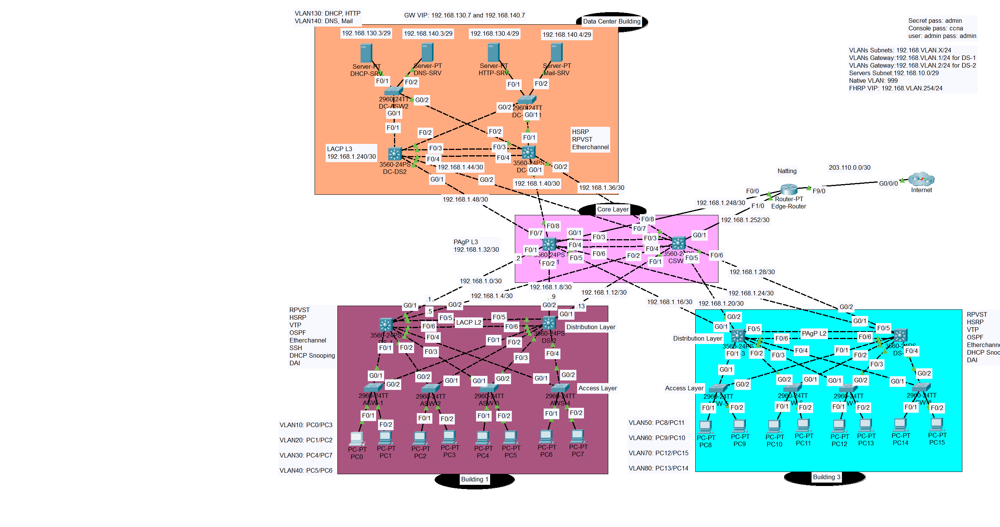

# 🏫 Full Campus 3-Tier Network Lab (Cisco Packet Tracer)

A complete enterprise-grade networking simulation project designed in **Cisco Packet Tracer**, implementing a **3-Tier Campus Architecture** across three buildings — including a Data Center and two User Buildings. This lab replicates real-world networking scenarios with a focus on scalability, security, redundancy, and high availability.

---

## 📁 Project Overview

This lab project models a structured enterprise network with multiple departments, services, and secure routing/switching practices. It's built using a **core-distribution-access** layered approach for clear segmentation and efficient management.

### 🏗️ Architecture

- **3-Tier Campus Model**
- **1 Data Center**
- **2 User Buildings**
- **Redundant Links + High Availability**

---

## 🔧 Technical Features

| Feature | Description |
|--------|-------------|
| ✅ **Dynamic Routing** | OSPF configured across the network for route sharing |
| ✅ **Switching Redundancy** | RPVST+ and EtherChannel between core/distribution layers |
| ✅ **Security** | DHCP Snooping, Dynamic ARP Inspection, Secure SSH access |
| ✅ **High Availability** | HSRP for gateway redundancy across key VLANs |
| ✅ **Network Services** | Internal DHCP, DNS, and HTTP servers deployed |
| ✅ **VLANs** | Structured VLANs (10–99) including Management VLAN |
| ✅ **VTP** | Centralized VLAN management using VTP |
| ✅ **NAT** | Static NAT for servers and PAT for user Internet access |

---

